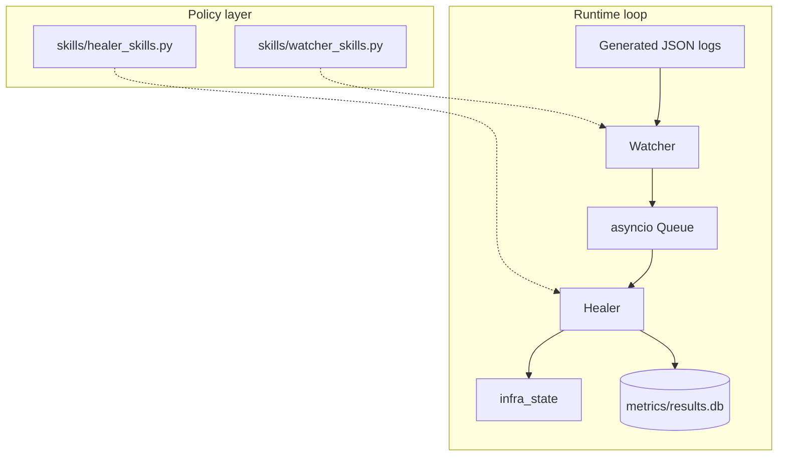

<div align="center">

# GHOST

### Grid Homeostasis & Orchestrated Self-healing Topology

**Autonomous detection and remediation for container-style failures — proven on a deterministic, audit-friendly loop.**

[](https://github.com/beejak/GHOST-PoC/actions/workflows/ci.yml)
[](LICENSE)
[](https://www.python.org/downloads/)
[](requirements.txt)
[](Ghost%20PoC.md.txt)

[**Repository**](https://github.com/beejak/GHOST-PoC) · [**Specification**](Ghost%20PoC.md.txt) · [**Quick start**](#quick-start)

</div>

---

## Table of contents

- [Overview](#overview)
- [Why GHOST exists](#why-ghost-exists)
- [What we built](#what-we-built)
- [How it works](#how-it-works)
- [Detection design (reducing bias)](#detection-design-reducing-bias)
- [Kubernetes-style structured signals](#kubernetes-style-structured-signals-experiment-4)
- [Validation & results](#validation--results)
- [Production & mission-critical systems](#production--mission-critical-systems)
- [Quick start](#quick-start)
- [Project structure](#project-structure)
- [Documentation](#documentation)
- [License](#license)

---

## Overview

GHOST is a **reference implementation** of a closed control loop:

**log signal → structured event → policy lookup → corrective action → measured outcome**

It targets **workload-agnostic** container runtime failure *modes* (OOM-style kills, crash loops, probe failures, latency thresholds) using **explicit patterns and decision tables** — not an LLM and not a third-party agent framework. Phase 1 runs **entirely on your machine**: synthetic logs, an in-memory service model, and a **reproducible harness** with SQLite metrics.

| Capability | Phase 1 |
|------------|---------|
| Real cloud / cluster APIs | No (simulated state) |
| LLM reasoning | No (deterministic matching) |
| External Python packages | No (standard library) |
| Repeatable experiment suite | Yes (`harness.py`) |
| Policy separated from agent code | Yes (`skills/` modules) |

---

## Why GHOST exists

Containers fail when operators are not staring at dashboards. Logs often already contain the diagnosis; runbooks describe the fix. The weak link is frequently the **latency and variance of the human chain**: page → wake → context switch → manual execution.

GHOST answers one precise question from our engineering specification:

> *Can a lightweight system detect a **known** container runtime failure from a log stream and execute the **correct** corrective action **faster and more reliably** than a human — with **zero human input after start**?*

We care because **MTTR** under automation is measurable. This repository **isolates** the autonomous loop so we can **prove** behavior and **regression-test** it before attaching real infrastructure, identity systems, or richer reasoning layers.

---

## What we built

Concretely, this repository delivers:

| Layer | Implementation |
|-------|----------------|
| **Detection policy** | `skills/watcher_skills.py` — substring sets per failure type, watched severities, event schema, explicit `CANNOT_DO` boundaries. |
| **Remediation policy** | `skills/healer_skills.py` — decision table `(failure_type → action, params)`, timeouts, default unknown handler, outcome schema. |
| **Watcher agent** | `agents/watcher.py` — imports patterns **only** from watcher skills; emits validated events on `ERROR` / `WARNING` lines. |
| **K8s signal policy** | `skills/k8s_signal_skills.py` — ordered declarative rules on a `signal` object (`record_type`, `phase`, `reason`, etc.). |
| **K8s signal agent** | `agents/k8s_watcher.py` — imports **only** `k8s_signal_skills`; same event envelope as the log Watcher so the Healer stays unified. |
| **Healer agent** | `agents/healer.py` — imports the decision table **only** from healer skills; executes registered actions against shared state. |
| **Event fabric** | `blackboard/event_bus.py` — `asyncio.Queue` with schema validation (typed handoff between agents). |
| **Simulated platform** | `simulator/infra_state.py` — `app-service` baseline dict; container actions plus **K8s-shaped** fields (`image`, `replicas_*`, `scheduling_blocked`, `node_ready`) and matching heal actions. |
| **Synthetic data** | `data/seed.py` — log datasets as before, plus **`k8s_clean_signals.json`** (Pod / Node / Deployment style records); outputs are **gitignored**. |
| **Streaming** | `data/generator.py` — async replay of JSON records for experiments. |
| **Experiments** | `experiments/run_experiment1.py` … `run_experiment4.py` — logs + **Experiment 4** full loop on synthetic K8s-style signals. |
| **Harness & metrics** | `harness.py` + `metrics/recorder.py` — orchestrates all scenarios, prints a summary, persists rows to `metrics/results.db`. |

**Design rule:** agents never duplicate patterns or decision tables inline — **skills are the single source of truth** for review, diff, and compliance-style audits.

---

## How it works

1. **Watcher** scans each log record (optionally tagged with a **stream index**). If severity is in scope, it walks `DETECTABLE_PATTERNS` in order and publishes **one** event on the first substring hit in `message`.
2. **Healer** awaits an event, resolves `(action, params)` via `DECISION_TABLE` (or `DEFAULT_ACTION`), runs the matching function in `ACTION_REGISTRY` on `infra_state`, and records **decide / act** timing (wrapped with `asyncio.wait_for` per skill timeouts).
3. **Harness** drives four experiments: log detection, log full loop, mixed stream, and **structured K8s-style signals** (`k8s_clean_signals.json`) with **per-scenario** `apply_k8s_failure_preset` + heal + assert.



### Detection design (broader coverage, less bias)

- **Case-insensitive matching** — Log lines are matched with **Unicode casefold**, and severities accept any casing (e.g. `error` / `ERROR`). That avoids favoring one vendor’s capitalization (Kubernetes vs Docker vs PaaS logs).
- **Vendor-neutral phrases** — `DETECTABLE_PATTERNS` includes multiple paraphrases per class (OOM / cgroup wording, crash-loop and backoff wording, probe and health-check failures, latency and timeout phrasing) so the PoC is not tuned to a single message shape.
- **Diverse synthetic failures** — `data/seed.py` picks among several templates per failure type for clean and mixed datasets, so experiments are not overfit to four fixed strings.
- **Shared healthy check** — The seed script uses the same `any_pattern_matches_message()` helper as policy in `watcher_skills.py`, so “no false patterns in healthy logs” is evaluated with the **same** rules as the Watcher (healthy lines were adjusted so phrases like “response time … within threshold” do not collide with latency rules once matching is case-insensitive).

First matching **failure type** in `DETECTABLE_PATTERNS` iteration order wins; patterns are ordered so higher-signal phrases are considered in a stable priority.

### Kubernetes-style structured signals (Experiment 4)

This is **not** a live cluster client: it is the **same Watcher → Healer loop** fed by JSON that resembles what you would derive from **kube-apiserver** watches (Pod/Node/Deployment-shaped objects).

| Synthetic class | Typical real-world analogue | Simulated heal |
|-----------------|----------------------------|----------------|
| `ImagePullBackOff` / `ErrImagePull` | Bad image tag, registry auth | Roll back to `image_previous` |
| `SchedulingBlocked` | `FailedScheduling` (resources, taints) | Clear `scheduling_blocked` |
| `NodeNotReady` | Node condition NotReady | Set `node_ready` |
| `ReplicaMismatch` | Deployment ready ≠ desired | `sync_replicas` |
| `PodDown` (Evicted) | Pod `Failed` + evicted / node pressure | `restore_workload` |

**Why this matters:** log substring matching alone is **biased** toward whatever format your app prints. Production agents usually combine **typed API objects + events + metrics**. Experiment 4 is a **stdlib-only** stepping stone: swap `signal` ingestion for an informer later without changing the Healer contract.

---

## Validation & results

**Continuous integration:** every push and pull request to `main` runs [`seed.py`](data/seed.py) and [`harness.py`](harness.py) on Python 3.11 via [GitHub Actions](https://github.com/beejak/GHOST-PoC/actions/workflows/ci.yml) (see the **CI** badge at the top).

Locally, the same commands execute:

| Experiment | What it proves | Expected outcome |
|------------|----------------|------------------|
| **1 — Detection** | Watcher finds all four failure types on clean logs | 4 / 4 scenarios **PASS** |
| **2 — Full loop** | Healer applies correct mutations after each clean failure (infra reset per scenario) | 4 / 4 assertions **PASS** (memory, port, instances, restart semantics) |
| **3 — Mixed stream** | 100 lines: 90 healthy + 10 injected failures | **10 / 10** detected, **0** false positives on healthy lines, **10 / 10** resolved vs ground truth |
| **4 — K8s signals** | 6 structured `signal` records (2× image pull paths + scheduling + node + replicas + evicted pod) | **6 / 6** **PASS** |

**Timing:** On fast local hardware, reported detect/decide/act milliseconds may round to **0 ms**; **correctness** is enforced by assertions, not wall-clock drama. Add delays in the generator or real I/O when you need representative latency distributions.

All runs append structured rows to **`metrics/results.db`** for downstream reporting or dashboards.

---

## Production & mission-critical systems

GHOST Phase 1 is a **laboratory instrument**, not a production controller. The **ideas** it embodies, however, map directly to how serious teams introduce automation safely.

**What transfers well**

- **Explicit policy** (versioned patterns + action tables) with **separation** from execution code — supports review, RBAC on changes, and post-incident audit (“what could the robot do?”).
- **Closed-loop tests** before prod: the same structure you see in Exp 2–3 should eventually run against **staging APIs** with **frozen** golden logs and expected state transitions.
- **Fast, bounded remediation** for **known** classes: restarts within caps, scale-out within limits, cache clears — actions that are **reversible** and **idempotent** when designed well.

**What production must add**

| Risk in naive automation | Mitigation in mission-critical environments |
|--------------------------|---------------------------------------------|
| Log substring **false positives** | Structured signals, alert correlation, rate limits, dry-run / canary, human approval for destructive classes |
| **Blast radius** | Hard quotas, multi-account isolation, circuit breakers, automatic rollback hooks |
| **Unknown / correlated failures** | Escalation paths, SLO-based policy, runbook coverage; LLM/heuristics **after** guardrails and retrieval — not instead of deterministic paths |
| **Governance** | IAM-bound actions, change windows, immutable audit trail, integration with ticketing and postmortems |

**Practical tiers** (how organizations usually evolve)

1. **Assisted ops** — automation gathers context and proposes steps; humans execute risky changes.  
2. **Guardrailed autonomy** — small set of **low-blast**, **reversible** actions with **hard caps** and **shadow mode** first.  
3. **Expanded policy** — broader coverage only where **harnesses** and **game days** prove safety.

**Bottom line:** GHOST demonstrates that a **deterministic** autonomous loop can be **built clearly and tested**. For mission-critical workloads, the long-term value is **shorter MTTR on known paths** and **less cognitive load** on operators — provided automation is **constrained**, **observable**, and **never** the only line of defense.

---

## Quick start

```bash
git clone https://github.com/beejak/GHOST-PoC.git
cd GHOST-PoC
python data/seed.py
python harness.py
```

**Important:** Generated JSON under `data/` is **not** committed (see `.gitignore`). **Always** run `seed.py` after a fresh clone before `harness.py`.

Optional: `python data/seed.py --seed 123` — different shuffle of failures inside the mixed stream.

**Runtime:** Python **3.11+** recommended; **3.9+** may work with the current codebase. Phase 1 requires **no** `pip install`.

---

## Project structure

```
GHOST-PoC/
├── skills/                 # Policy: log patterns, K8s signal rules, decision table
├── agents/                 # Watcher & Healer (import skills only)
├── blackboard/             # Event bus (asyncio queue + validation)
├── simulator/              # Fake infra state + action implementations
├── data/
│   ├── seed.py             # Synthetic dataset generator
│   ├── generator.py        # Async JSON stream for harness
│   └── scenarios.json      # Scenario metadata
├── experiments/            # Experiment 1–4 runners
├── metrics/                # SQLite recorder + optional reporter
├── harness.py              # Single entrypoint: all experiments
├── Ghost PoC.md.txt        # Full build specification
├── README.md
├── LICENSE
└── requirements.txt        # Phase 2 placeholders only
```

---

## Documentation

| Document | Contents |
|----------|----------|
| [**Ghost PoC.md.txt**](Ghost%20PoC.md.txt) | Full specification: problem statement, failure domain, agent contracts, data formats, harness assertions, definition of done, future phases. |
| This **README** | Product-oriented overview, validation summary, and production framing. |

---

## License

Licensed under the **Apache License 2.0** — see [LICENSE](LICENSE).

---

<div align="center">

**GHOST** · *Prove the loop in the lab. Earn the right to run it in production.*

<sub>If you extend this work, preserve the <strong>skills-as-policy</strong> pattern — it is the primary maintainability and auditability lesson from Phase 1.</sub>

</div>
