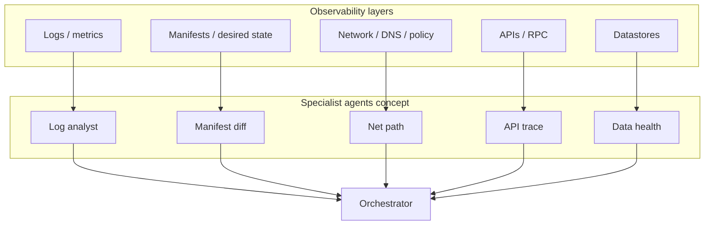
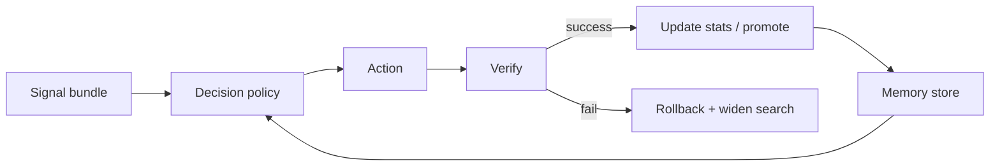

# Layered failures, partial information & learning-oriented agents

This document extends the GHOST PoC with a **systems architecture view**: how failures appear across **layers**, how humans operate when **not all signals exist**, how a **multi-agent** design could mirror that, and where **feedback loops** for self-improvement plug in. It is **aspirational** relative to the current stdlib-only PoC; use it as a roadmap, not a promise of implemented features.

---

## 1. Failure layers (what can break)

Think in **planes of observability**. A single user-visible “503” often has a chain across layers.

| Layer | Typical artifacts | What you see when it breaks |
|-------|-------------------|----------------------------|
| **Workload / log** | Container stdout, app logs, language stack traces | Panic, OOM message, timeout string, probe failure text |
| **Manifest / desired state** | Deployment, STS, Service, Ingress, HPA, PDB, ConfigMap/Secret refs | Wrong image, bad env, bad command, bad probe path, impossible resources |
| **Platform / scheduling** | Pod status, events, node conditions | `Pending`, `CrashLoopBackOff`, `ImagePullBackOff`, eviction |
| **Network** | Service endpoints, NetworkPolicy, DNS, Ingress/Gateway, mesh | No endpoints, `connection refused`, NXDOMAIN, TLS errors |
| **API / RPC** | HTTP/gRPC status, dependency clients | 502/503 upstream, rate limits, auth 401/403 |
| **Data** | DB metrics, replication lag, disk, connection pools | Timeouts, deadlocks, saturation, split-brain symptoms |

GHOST Phase 1 today exercises **log-shaped** and **synthetic K8s signal-shaped** slices of this stack. A production “Hermes-style” system would **fuse** multiple planes instead of trusting one.

---

## 2. Partial information (how humans actually troubleshoot)

Operators rarely have **all** layers at once. A realistic playbook:

1. **Start from the symptom** (alert, ticket, “slow checkout”) — often **one** layer visible first.  
2. **Form hypotheses** ranked by **prior** (recent change, blast radius, dependency map).  
3. **Gather missing evidence** — pull pod describe, recent deploy, dependency dashboards, a single trace.  
4. **Narrow** — rule out layers with cheap checks before expensive ones (e.g. endpoints empty before deep DB forensics).  
5. **Act under uncertainty** — safe, reversible steps first (restart bounded, scale within cap, rollback canary).  
6. **Verify** — did SLO recover? if not, **update belief** and widen search.

An agent system should **encode** this as **explicit state**: “what we know”, “what we assume”, “what we need next”, not a single-shot log grep.

---

## 3. Swarm / multi-agent shape (“Hermes-like”)

Name aside, the useful pattern is **specialists + coordinator**:

| Role | Responsibility |
|------|----------------|
| **Coordinator / router** | Owns incident state, chooses next evidence or action, enforces guardrails and budgets. |
| **Log / event specialist** | Patterns, anomalies, correlation with deploy time. |
| **Topology / manifest specialist** | Diff desired vs live, known-good revision, rollout history. |
| **Network specialist** | Endpoints, DNS, policy, ingress path. |
| **API / dependency specialist** | Golden traces, dependency SLOs, circuit breaker state. |
| **Data specialist** | Read-only health queries, lag, pool usage (strictly bounded). |

**Swarm** does not mean “many LLMs free-for-all”. It means **partitioned skills** (each with `CANNOT_DO`), a **shared blackboard** (incident object + evidence ledger), and a **single executor** for dangerous actions.

GHOST today is a **minimal two-agent** slice (Watcher + Healer) with a **queue**. The path to a swarm is: **more watchers** (or one Watcher with typed channels), **one policy orchestrator**, **same Healer contract** or **per-domain healers** with a **merge policy**.

---

## 4. Topology-aware behavior

“Learning from topology” in practice means maintaining a **living model** (graph or document) of:

- Services, dependencies, owners, SLOs  
- **Last known good** deployment identifiers  
- Blast-radius tags (data plane vs edge)  
- **Allowed actions** per namespace / tier  

Updates come from **GitOps**, **service catalog**, **CMDB**, or **inferred** from stable labels — refreshed on a schedule, not only at incident time.

The coordinator uses this model to **bias** hypothesis order (e.g. “checkout depends on payments; payments DB lagging → check data layer before random pod restarts”).

---

## 5. Feedback loops for self-learning (honest taxonomy)

“Self-learning” mixes several mechanisms; be precise about which you want.

| Loop type | What improves | Typical mechanism | Risk |
|-----------|---------------|-------------------|------|
| **Outcome feedback** | Action choice | After each heal: success/fail + SLO delta → update policy weights or allowlist | Reward hacking if metric wrong |
| **Human-in-the-loop** | Precision | Operator marks false positive / wrong heal → adjust patterns or rules | Label lag |
| **Memory / retrieval** | Speed | Store incident embeddings + resolution; retrieve similar past cases | Stale playbooks |
| **Offline evaluation** | Safety | Replay historical incidents in sandbox; require pass before policy promotion | Data drift |
| **Bandit / exploration** | Under uncertainty | Try low-risk variant actions with exploration budget | Needs caps |

**Important:** Pure substring rules **do not learn** by themselves. Learning requires **stored outcomes**, a **scoring function**, and a **promotion pipeline** (what becomes default policy). That can be as simple as **SQLite counts** of “action X after signal Y → success” before you add ML.

A minimal feedback schema (conceptual):

---

## 6. Mapping this vision onto the current GHOST repo

| Vision element | Today in repo | Next incremental steps |
|-----------------|---------------|-------------------------|
| Layered signals | Logs + synthetic K8s JSON | Add optional **manifest snapshot** JSON channel; add **network symptom** rules |
| Partial info | N/A (full synthetic record) | Introduce **incident state** object and **staged** harness scenarios |
| Multi-agent | Watcher + Healer | Split watchers by channel; add **coordinator** that consumes multiple queues or one typed queue |
| Topology | Static `app-service` | External **topology.json** + loader; coordinator reads it |
| Learning | `metrics/results.db` + **`metrics/feedback.py`** | Each harness run appends a JSON summary to **`feedback_rows`** (`run_id`, payload) for offline learning; add human labels / bandits in a later phase |
| Real APIs | None | Optional `requirements.txt` phase: kubernetes client, read-only RBAC |

---

## 7. Design rules (carry forward from GHOST)

1. **Skills remain the contract** — what each agent may observe and do is **declarative** and reviewable.  
2. **No silent learning in prod** — promote policy changes via **CI + replay harness**.  
3. **Reversible before destructive** — coordinator default ordering.  
4. **Assume incomplete data** — explicit “unknown” states, not false confidence.

---

## 8. AI “virtual dev teams” (e.g. GStack-style) vs GHOST

Products marketed as **virtual software development teams** usually focus on **authoring change**: planning features, editing code, opening PRs, running tests in a dev environment. That is **development-time** work with a human reviewer in the loop.

GHOST, as built in this repo, targets **runtime / operations-time** work: **detect** failure signals from logs or structured platform events, **apply** a **pre-reviewed** policy (`skills/`), **verify** outcome, **record feedback**. It is deliberately **not** an open-ended coding agent in production.

**They complement each other** when you keep a hard boundary:

| Concern | Virtual dev team | GHOST-style runtime loop |
|---------|------------------|---------------------------|
| **Primary job** | Implement features, refactors, tests | Stabilize known failure classes fast |
| **Changes prod?** | Only via your normal CI/CD (merge, deploy) | Only via **allowlisted** automated actions you already approved in policy |
| **Learning** | From code review, CI, human edits | From `feedback_rows`, harness replays, optional human labels on incidents |

**Reasonable integration patterns**

1. **Policy authoring** — After an incident, the virtual dev team proposes a **diff to `skills/*.py`** (new patterns or decision-table rows) from a ticket; humans merge after `harness.py` passes. GHOST stays deterministic; the AI team is a **faster typist + researcher**, not the executor in prod.  
2. **Ticket bridge** — GHOST (or your orchestrator) opens/updates an issue with **signal bundle + suggested skill change**; the dev team implements and ships policy in the next release.  
3. **Separate runtime** — Do **not** let an unconstrained coding swarm **directly** call `gk`, `kubectl`, or cloud APIs during an incident unless that tool is wrapped with the same **guardrails** as the Healer (timeouts, allowlists, audit).

**What to avoid**

- Collapsing “fix the outage” and “rewrite the service” into one agent with live prod access.  
- Treating LLM-generated remediation as **authority** without verification and rollback.

In short: **yes, you can incorporate a virtual dev team into your *overall* system** — mainly on the **left side of the pipeline** (code and policy change) and in **post-incident hardening**, while GHOST (or its production successor) owns the **tight runtime loop** under explicit policy.

---

## 9. Further reading in this repository

- [README.md](../README.md) — what is implemented today.  
- [HELP.md](HELP.md) — operations, real vs synthetic data.  
- [Ghost PoC.md.txt](../Ghost%20PoC.md.txt) — original Phase 1 specification.

When you implement pieces of this vision, **update this document** so the gap between aspiration and code stays honest.
